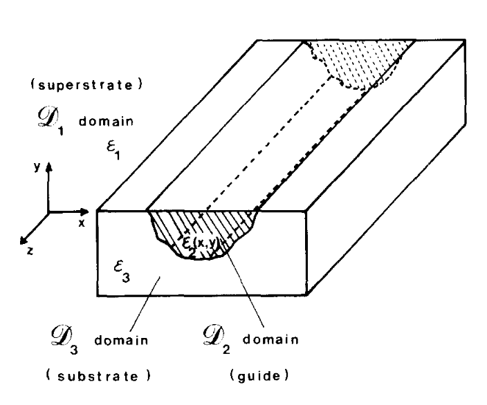

# 2. Teoria

Nota editorial:
para a convenção geométrica operacional do repositório, o dicionário de símbolos, a separação explícita dos perfis de índice e a tradução das Eqs. (1) a (8) em passos computacionais, ver `docs/02_formulacao_do_problema_de_valor_de_contorno.md`, `docs/02_symbol_dictionary.md` e `docs/12_trilha_equacoes_para_codigo.md`.

A inomogeneidade considerada aqui é mostrada na Fig. 1. Ela preenche o domínio $\mathcal{D}_2$ (meio II - guia) com um perfil de permissividade $\varepsilon_2(x,y)$, que pode ser uma função descontínua ou contínua. Esse domínio é circundado pelos domínios $\mathcal{D}_1$ (superstrato) e $\mathcal{D}_3$ (substrato), com permissividades constantes $\varepsilon_1$ e $\varepsilon_3$, respectivamente $(\mu=\mu_0$ em cada meio). $\mathcal{R}$ é a fronteira entre os domínios $\mathcal{D}_2$, $\mathcal{D}_1$ e $\mathcal{D}_3$.

Figura 1 — Geometria do problema: guia de onda dielétrico inomogêneo embutido em um substrato.

Com uma dependência temporal $e^{-i\omega t}$ e propagação ao longo do eixo $z$, tal que

$$
\mathbf{E}(x,y,z)=\mathbf{E}(x,y)e^{i\beta z}
$$

o campo elétrico $\mathbf{E}$ satisfaz a equação de Helmholtz no sentido das distribuições:

## (1)

$$
\left(\Delta + (k_3^2-\beta^2)\right)\mathbf{E}(x,y) = \left(k_3^2-k^2(x,y)\right)\mathbf{E}(x,y) + e^{-i\beta z}\,\mathrm{grad} \left[ \varepsilon(x,y)\, \mathrm{grad}\!\left(\frac{1}{\varepsilon(x,y)}\right) \cdot \mathbf{E}(x,y)e^{i\beta z} \right]
$$

com

## (2)

$$
k^2(x,y)= \begin{cases} k_1^2, & y>0,\quad (x,y)\in \mathcal{D}_1,\\[4pt] k_2^2(x,y), & (x,y)\in \mathcal{D}_2,\\[4pt] k_3^2, & (x,y)\in \mathcal{D}_3, \end{cases}
$$

$$
k_j(x,y)=k_0\,\eta_j(x,y)
$$

$$
\eta_j(x,y)=\left[\frac{\varepsilon_j(x,y)}{\varepsilon_0}\right]^{1/2}, \qquad j=1,2,3
$$

Utilizando o teorema vetorial de Green, obtém-se, para o campo elétrico $\mathbf{E}$, uma equação integral exata:

## (3)

$$
\begin{aligned}
\mathbf{E}(x,y) = & \iint_{\mathcal{D}_2} \left(k^2(x',y')-k_3^2\right) \mathbf{E}(x',y') \times G(x,y;x',y') \,dx'\,dy' \\
& + \iint_{\mathcal{D}_2} \varepsilon(x',y')\, \mathrm{grad}'\!\left(\frac{1}{\varepsilon(x',y')}\right) \cdot \mathbf{E}(x',y') \times \mathrm{grad}'\,G(x,y;x',y') \,dx'\,dy'
\end{aligned}
$$

No sentido das distribuições,

## (4)

$$
\varepsilon(x,y)\,\mathbf{E}(x,y)\cdot \mathrm{grad}\!\left(\frac{1}{\varepsilon(x,y)}\right) = \varepsilon(x,y)\,\mathbf{E}(x,y)\cdot \left[ \left\{ \mathrm{grad}\!\left(\frac{1}{\varepsilon(x,y)}\right) \right\} + n_0\,\sigma_{1\varepsilon}\,\delta_{\mathcal{R}} \right]
$$

onde

$$
\left\{ \mathrm{grad}\!\left(\frac{1}{\varepsilon(x,y)}\right) \right\}
$$

significa que a derivação deve ser tomada no sentido funcional, $\sigma_{1/\varepsilon}$ representa a variação do valor da função $1/\varepsilon$ sobre a fronteira $\mathcal{R}$, e $\delta_{\mathcal{R}}$ é a distribuição cilíndrica definida em $\mathcal{R}$.

A função de Green $G(x,y;x',y')$ é a função associada a uma fonte linear embutida no substrato (meio III), quando a inomogeneidade é removida. Ela é dada, em termos de transformada de Fourier, por:

## (5)

para $y<0$,

$$
G(x,y;x',y') = \int_{-\infty}^{+\infty} \frac{ \exp(-\gamma_1 y)\, \exp(\gamma_3 y')\, \exp\!\left[2i\pi\nu(x-x')\right] }{ \gamma_1+\gamma_3 } \,d\nu
$$

e para $y>0$,

$$
G(x,y;x',y') = \int_{-\infty}^{+\infty} \frac{1}{2\gamma_3} \left[ \exp\!\left(-\gamma_3|y-y'|\right) + \frac{\gamma_3-\gamma_1}{\gamma_3+\gamma_1} \exp\!\left[-\gamma_3(y+y')\right] \right] \exp\!\left[2i\pi\nu(x-x')\right] \,d\nu
$$

com

## (6)

$$
\gamma_1^2 = 4\pi^2\nu^2 + \beta^2 - k_1^2 > 0
$$

$$
\gamma_3^2 = 4\pi^2\nu^2 + \beta^2 - k_3^2 > 0
$$

No meio III $(y>0)$, $G(x,y;x',y')$ é expresso como a soma de duas funções, $G_{S}$ e $G_{NS}$, com

## (7)

$$
\begin{aligned}
G_{S}(x,y;x',y') & = \int_{-\infty}^{+\infty} \frac{1}{2\gamma_3} \exp\!\left(-\gamma_3|y-y'|\right) \exp\!\left[2i\pi\nu(x-x')\right] \,d\nu \\
& = \frac{1}{2\pi} K_0\!\left( (\beta^2-k_3^2)^{1/2} \left[ (x-x')^2+(y-y')^2 \right]^{1/2} \right)
\end{aligned}
$$

onde $K_0(x)$ é a função de Bessel modificada de ordem zero.

Além disso,

$$
G_{NS}(x,y;x',y') = \int_{-\infty}^{+\infty} \frac{1}{2\gamma_3} \frac{\gamma_3-\gamma_1}{\gamma_3+\gamma_1} \times \exp\!\left[-\gamma_3(y+y')\right] \exp\!\left[2i\pi\nu(x-x')\right] \,d\nu
$$

O aspecto vetorial da equação integral (3) decorre do fato de que os modos guiados são híbridos. O guia de onda suporta a propagação de ondas com duas configurações possíveis de campo, classificadas como modos $E^{y}_{pq}$ e $E^{x}_{pq}$ [17], em que os subscritos $p$ e $q$ indicam o número de extremos do campo elétrico nas direções $x$ e $y$, respectivamente.

Para resolver a equação integral vetorial (3), foram utilizados os métodos clássicos dos momentos [18], que conduzem ao sistema linear

## (8)

$$
AX=0
$$

onde $X$ representa os valores de $E_x$ e $E_y$ expandidos em funções de base adequadas.

Os valores de $\beta$ são os zeros de $\det(A)$, e, a partir de $X$, pode-se obter a distribuição do campo elétrico no interior do guia. O tamanho da matriz $A$ depende da forma da função de base, do número de pontos de amostragem relacionado às dimensões transversais do guia por comprimento de onda, da variação do índice de refração e da estrutura modal estudada. Neste trabalho, foram adotadas funções degrau como base.

A fim de testar a precisão do método integral, os resultados obtidos foram comparados com aqueles fornecidos por outras técnicas numéricas: Yeh et al. (método dos elementos finitos) [9,10], Goell (análise computacional por expansão harmônica circular) [3] e o método aproximado de Marcatili [4].

Também foi utilizado um método aproximado baseado no método do índice efetivo [5,6], no qual a equação de dispersão para o caso do guia de canal difundido, dada pela aproximação W.K.B. ou por uma equação equivalente [6], é substituída por uma solução rigorosa obtida por uma equação integral [16]. Essa solução aproximada será chamada de método do índice efetivo “modificado”.

---
**Navegação:** [00 Resumo](00_titulo_autoria_resumo.md) | [01 Introdução](01_introducao.md) | [02 Formulação](02_formulacao_do_problema_de_valor_de_contorno.md) | [02 Símbolos](02_symbol_dictionary.md) | [02 Teoria](02_teoria.md) | [03 Resultados](03_resultados_numericos.md) | [04 Conclusões](04_conclusoes.md) | [05 Referências](05_referencias.md) | [06 Auditoria](06_auditoria_inicial_do_repositorio.md) | [12 Trilha do Código](12_trilha_equacoes_para_codigo.md) | [Plano](../PLAN.md) | [TODO](../TODO.md)
