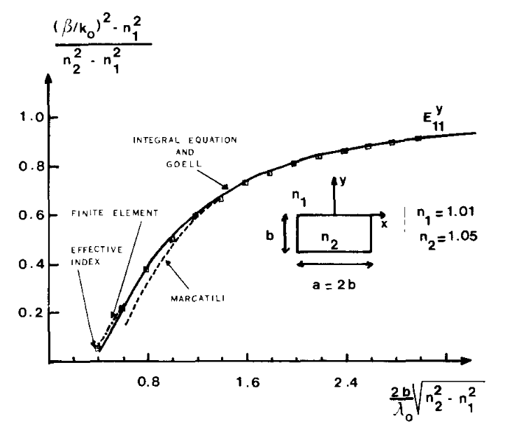
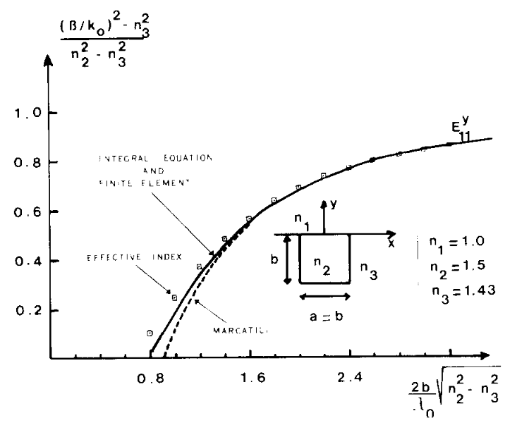
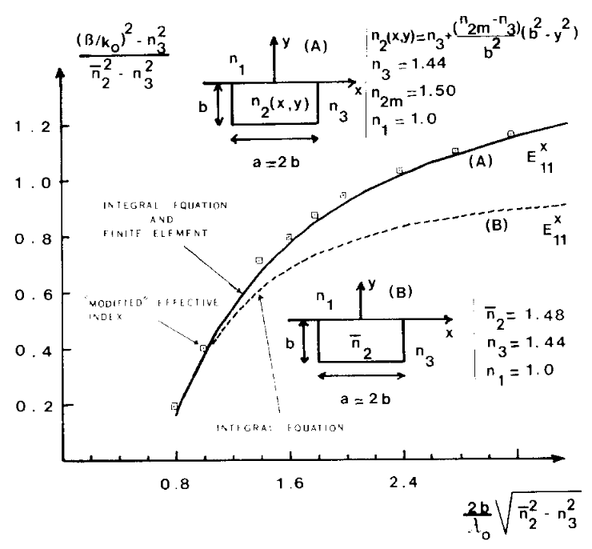
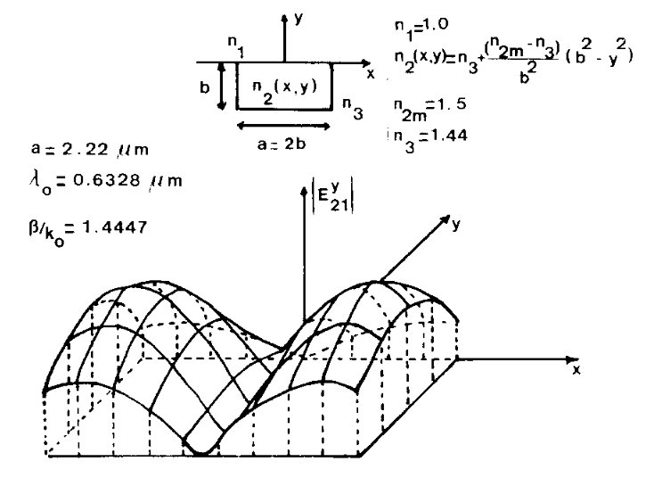
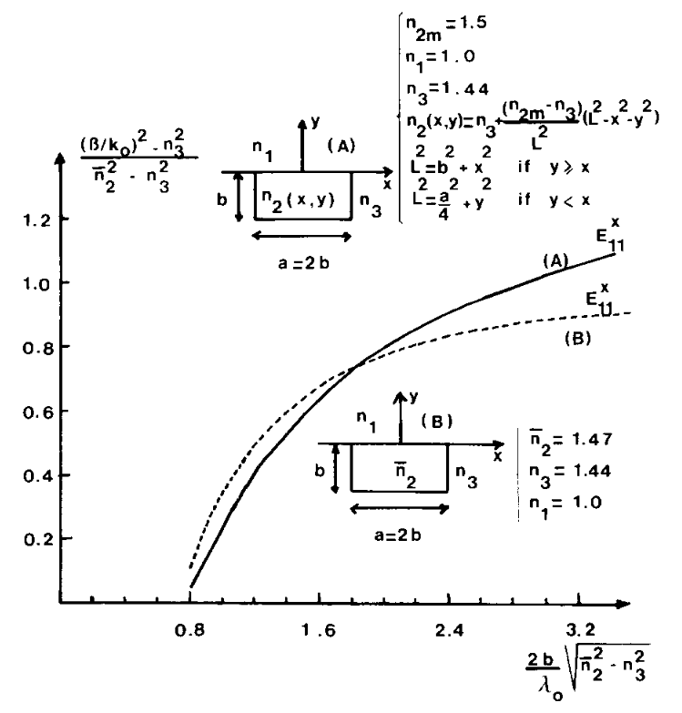

# 3. Resultados numéricos

Vários exemplos são propostos aqui.

## 3.1. Fibra retangular homogênea

Yeh [9,10], utilizando o método dos elementos finitos, Goell [3], utilizando a técnica de expansão harmônica, e Marcatili [4], utilizando técnicas aproximadas, obtiveram as características de dispersão de guias de onda dielétricos retangulares.

Comparamos esses resultados com aqueles obtidos pelo método da equação integral vetorial. Os resultados são mostrados na Fig. 2 para o modo \(E^{y}_{11}\). Foi encontrado excelente acordo com os resultados de Goell, e observa-se uma diferença entre nossos resultados, os de Yeh e os de Marcatili nas proximidades da frequência de corte.

Figura 2 — Comparação dos resultados da equação integral vetorial para o modo $E^{y}_{11}$ com o método dos elementos finitos, os resultados de Goell, o método aproximado de Marcatili e o método do índice efetivo.

## 3.2. Guia de canal homogêneo

Mostra-se na Fig. 3 a comparação entre nossos resultados e aqueles obtidos por Yeh, Marcatili e pelo método do índice efetivo para o guia de canal homogêneo no modo $E^{y}_{11}$. Observa-se boa concordância entre a equação integral vetorial e os resultados de Yeh.

Em baixas frequências, a curva de Marcatili desvia dos resultados de Yeh e dos nossos.

Figura 3 — Relação de dispersão de um guia de canal homogêneo. Comparação da equação integral vetorial com os resultados do método dos elementos finitos, a abordagem de Marcatili e o método do índice efetivo.

## 3.3. Guias de canal inomogêneos

### 3.3.1. Difusão parabólica: modo $E^{x}_{11}$

Apresenta-se aqui a curva de dispersão para o modo $E^{x}_{11}$ no caso de um guia de canal difundido com difusão unidirecional ao longo do eixo $y$, com forma parabólica do índice de refração

$$
n_2(x,y)=n_3+\frac{(n_{2m}-n_3)(b^2-y^2)}{b^2}, \qquad 0<y<b
$$

onde $b$ é a profundidade de difusão, $n_{2m}$ é o índice de refração máximo na superfície e $n_3$ é o índice de refração do substrato.

Essa variação de índice foi investigada por Yeh [10]. Assume-se que o processo de difusão está limitado à região retangular do núcleo. A razão entre a abertura da máscara $a$ e a profundidade de difusão $b$ é igual a 2.

Na Fig. 4, comparamos o guia de canal difundido (curva A) com um guia de canal homogêneo que possui, no interior do núcleo, o índice médio $\bar{n}_2$ do guia difundido $(\bar{n}_2=1.48)$ (curva B). Também realizamos a comparação com o método do índice efetivo “modificado” e com o método de Yeh.

A concordância entre os resultados de Yeh e os da equação integral vetorial é boa. O método do índice efetivo “modificado” fornece uma boa aproximação dos resultados.

Figura 4 — Curvas de dispersão para o modo dominante $E^{x}_{11}$ em um guia de canal difundido 1-D e em um guia de canal uniforme. Comparação da equação integral vetorial com o método dos elementos finitos e com o método do índice efetivo “modificado”.

Na Fig. 5, representamos o módulo $|E_y(x,y)|$ do campo elétrico para o modo $E^{y}_{21}$ no guia de canal difundido com difusão parabólica, utilizando uma malha de 50 pontos (10 no eixo $x$ e 5 no eixo $y$), no comprimento de onda de $0.6328\,\mu\text{m}$ (comprimento de onda do laser He-Ne), com dimensão $a=2.22\,\mu\text{m}$.

Figura 5 — Distribuição de campo do módulo de $E_y(x,y)$ para o modo $E^{y}_{21}$, no comprimento de onda $\lambda_0=0.6328\,\mu\text{m}$, em um guia de canal difundido 1-D com perfil parabólico do índice de refração, com $a=2b=2.22\,\mu\text{m}$.

### 3.3.2. Difusão circular: modo $E^{x}_{11}$

Examina-se aqui o caso de uma forma circular para o índice de refração $n_2(x,y)$. Assim como antes, considera-se uma região de núcleo retangular circundada por um substrato uniforme.

O índice de refração é descrito por

$$
n_2(x,y)=n_3+\frac{(n_{2m}-n_3)}{L^2}(L^2-x^2-y^2)
$$

onde $n_{2m}$ é o índice máximo na origem, $n_3$ é o índice do substrato, e

$$
L^2=b^2+x^2 \quad \text{se } y>x
$$

$$
L^2=\left(\frac{a}{2}\right)^2+y^2 \quad \text{se } y<x
$$

Aqui, $a$ e $b$ são, respectivamente, a largura e a profundidade do núcleo. $L$ é o comprimento da reta que vai da origem até a fronteira.

Também foi realizada a comparação com um guia de canal homogêneo que possui o índice médio $\bar{n}_2$ do guia difundido $(\bar{n}_2=1.47)$, correspondente à curva B da Fig. 6.

Figura 6 — Curvas de dispersão para o modo dominante $E^{x}_{11}$ em um guia de canal difundido 2-D e em um guia de canal uniforme.
